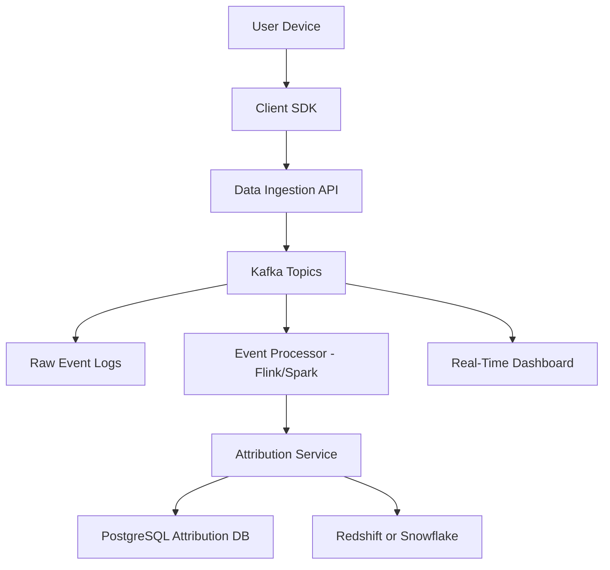
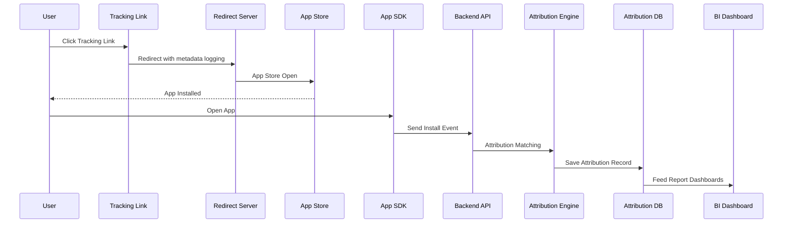
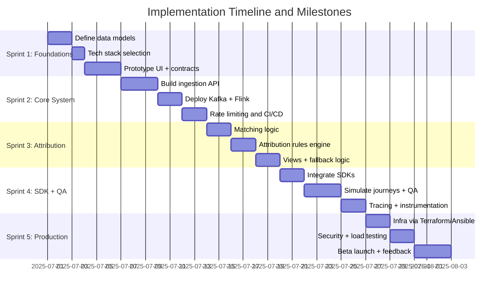

---

## title: report\_a04\_part01\_custom\_tracking

---

## Custom Tracking Service Design

---

### Overview and Objectives

<details>
<summary>Define the scope, goals, and rationale for building a custom tracking system</summary>

---

* **Goal**: Design and implement a custom tracking service for both web and mobile platforms to collect, process, and analyze user behavioral data from app installs to post-install interactions.

  * This system should enable attribution of marketing campaigns, event tracking, and funnel analysis without relying on third-party platforms.
  * The solution must offer real-time capabilities and offline resilience, operating across all major OS and browser environments.

* **Strategic Importance**:

  * Enhance **marketing attribution precision** across all digital campaigns by enabling detailed, verifiable tracking from ad impressions to user actions within the app.
  * Provide **product teams** with granular insights into user interactions, session flows, feature adoption, and error rates to improve UX and retention.
  * Enable **data science teams** to build reliable data models for user segmentation, churn prediction, and customer lifetime value (LTV) estimation.
  * Support **privacy-first strategies** to address evolving regulations and platform restrictions (e.g., iOS ATT, GDPR, CCPA).

* **Key Objectives**:

  * Implement **end-to-end tracking**, including support for click-through, view-through, first-touch, last-touch, and multi-touch attribution.
  * Build a system that supports **real-time data ingestion** with event enrichment pipelines and delayed processing for aggregated analytics.
  * Ensure **cross-platform compatibility**, covering:

    * Native Android/iOS apps
    * React Native and hybrid apps
    * Web applications across modern browsers
  * Design for **security**, including TLS encryption, token-based access, and secure cookie handling.
  * Achieve **privacy compliance** via user consent management, configurable retention policies, and audit logging.

* **Scope of Work**:

  * Implement app install attribution using **deferred deep linking**, **device fingerprinting**, and **click ID resolution**.
  * Enable **event collection** for sessions, conversions, lifecycle events, and custom engagement signals.
  * Include robust **data validation, deduplication, and enrichment** to ensure consistency and accuracy.
  * Build a **dashboard interface** for real-time analytics, campaign performance, and funnel visualization.

* **Audience**:

  * **DevOps and data engineering teams** for infrastructure provisioning, data pipeline reliability, and system scalability.
  * **Backend engineers** for implementing API endpoints, attribution logic, and SDK communications.
  * **Mobile and web developers** responsible for integrating SDKs into the app ecosystem.
  * **Analysts and marketers** who consume the data for decision-making, experimentation, and ROI tracking.
  * **Legal and compliance officers** validating that the system aligns with regulatory requirements for data governance.

---

</details>

### Architecture Design

<details>
<summary>Proposed system architecture and component overview</summary>

---

#### Component Interaction Overview

* **Tracking SDKs** → **Event Collection Layer**:

  * SDKs embedded in client applications send structured events directly to the ingestion API endpoints.
  * They attach user identifiers, app version info, and contextual metadata to every event.

* **Tracking Link Generator** → **Attribution Engine**:

  * When users click campaign links, the redirect handler logs metadata and stores click records in a temporary cache (e.g., Redis).
  * These logs are later fetched by the attribution engine to match with install events.

* **Event Collection Layer** → **Kafka Topics**:

  * Collected events are streamed to Kafka, enabling decoupled and scalable downstream processing.

* **Kafka Topics** → **Event Processor**:

  * Apache Flink or Spark Streaming jobs consume event streams to transform, enrich, and deduplicate events.
  * The processor emits both enriched events and attribution-ready signals.

* **Event Processor** → **Attribution Engine**:

  * Enriched install events trigger the attribution matching logic.
  * The attribution engine queries cached click data, computes attribution, and emits match records.

* **Attribution Engine** → **PostgreSQL Attribution DB**:

  * Attribution results are inserted into a normalized schema suitable for joins with user, campaign, and event data.

* **PostgreSQL Attribution DB** → **Analytics and Reporting Layer**:

  * A nightly ETL or streaming sync copies attribution and event data to OLAP stores (e.g., Redshift/Snowflake).
  * BI tools query the OLAP layer to power dashboards and reports.

* **System Monitoring and Alerting**:

  * Hooks into all components via Prometheus exporters.
  * Tracks ingestion rate, latency, errors, and attribution throughput end-to-end.

---

#### Key Components

* **Tracking SDKs**: Language-specific libraries (JavaScript for web, Swift for iOS, Kotlin for Android) that initialize early on app startup to capture contextual data. SDKs should:

  * Handle offline queuing and retry mechanisms
  * Provide interfaces for custom event tracking and user properties
  * Respect platform-specific privacy limitations like iOS App Tracking Transparency (ATT)

* **Tracking Link Generator (Campaign Manager)**:

  * Enables marketers to generate UTM-tagged short links for campaigns
  * Integrates with ad networks for click callbacks
  * Supports deferred deep links for post-install redirection
  * Provides an audit log of all generated links for compliance and debugging

* **Event Collection Layer (REST APIs + CDN endpoint)**:

  * Collects events in a scalable, geo-distributed setup via edge nodes
  * Performs schema validation using Avro/JSON schema
  * Normalizes timestamps, device metadata, and campaign identifiers
  * Buffers traffic during spikes and implements retry/backoff logic

* **Attribution Engine**:

  * Maintains in-memory data store (e.g., Redis or Memcached) for recent click metadata
  * Implements configurable attribution windows (e.g., 7-day click-through, 24-hour view-through)
  * Supports hybrid attribution: first-party deterministic and probabilistic fallback mechanisms
  * Logs attribution decisions for auditability

* **Analytics and Reporting Layer**:

  * Event stream enriched and transformed via Apache Flink/Spark
  * Supports star schema for reporting tables (`fact_events`, `dim_users`, `dim_campaigns`)
  * Enables both scheduled batch reporting and real-time dashboards
  * Provides prebuilt funnel and retention queries via Looker/Superset

* **System Monitoring and Alerting**:

  * Metrics exposed via Prometheus exporters (API throughput, latency, attribution accuracy)
  * Visual dashboards via Grafana
  * Alert policies configured in PagerDuty for 5xx errors, latency spikes, or dropped messages
  * Logging pipeline includes ELK or Loki stack for centralized log aggregation

---

#### Infrastructure Flow Diagram



* Events are tagged with `user_id`, `device_id`, `campaign_id`, and `event_type`

* Attribution events are stored with reference to tracking metadata and computed conversion windows

---

</details>

### Technical Implementation Strategy

<details>
<summary>Development approach and core functionalities</summary>

---

#### Tracking Link Mechanics

* **URL Pattern**: `https://track.mycompany.com/redirect?cid=abc123&adgroup=summer_promo`

* **Click Action Sequence**:

  * User clicks a campaign tracking link.
  * Server logs click metadata and stores it in Redis:

    ```python
    # Python-like pseudocode
    click_metadata = {
      "cid": "abc123",
      "adgroup": "summer_promo",
      "timestamp": current_timestamp(),
      "user_agent": request.headers.get("User-Agent"),
      "ip": request.remote_addr
    }
    redis.setex("click:uuid-1234", timedelta(hours=48), json.dumps(click_metadata))
    ```
  * Server generates a redirect:

    ```http
    HTTP/1.1 302 Found
    Location: https://apps.apple.com/app/example-app/id123456
    ```

* **Device Fingerprinting**:

  * Hash is generated to identify users anonymously:

    ```js
    const fingerprint = hash(
      navigator.userAgent + screen.width + screen.height + navigator.language + timezoneOffset
    );
    ```

* **Deferred Deep Linking**:

  * On app open, the SDK parses install referrer:

    ```kotlin
    val referrer = getInstallReferrer()
    val campaignId = extractParam(referrer, "cid")
    ```

* **App Open Attribution**:

  * Install event sent to backend:

    ```json
    {
      "event": "install",
      "device_id": "abcd-1234",
      "timestamp": "2025-07-10T08:00:00Z",
      "referral": {
        "click_id": "uuid-1234",
        "campaign_id": "abc123"
      }
    }
    ```
  * Attribution engine checks Redis:

    ```python
    click = redis.get("click:uuid-1234")
    if click:
      save_attribution(install_id, click)
    else:
      mark_as_organic(install_id)
    ```

* **Logging and Debugging**:

  * All data written to log stream:

    ```json
    {
      "event": "redirect",
      "status": "200",
      "click_id": "uuid-1234",
      "ip": "192.168.1.10",
      "user_agent": "Mozilla/5.0"
    }
    ```
  * Debug dashboard uses this to:

    * Trace attribution failures
    * Replay scenarios for QA

---

#### Event Collection Pipeline

* **Supported Event Types**:

  * Standard: `install`, `session_start`, `page_view`, `add_to_cart`, `purchase`, `logout`, `unsubscribe`
  * Custom: defined by clients via SDK

    ```javascript
    analytics.track("search", {
      keyword: "wireless headphones",
      category: "electronics"
    });
    ```
  * Lifecycle: tracked automatically on app load/unload or screen transitions

* **Ingestion Endpoints**:

  * `/v1/event`: General-purpose event receiver
  * `/v1/install`: Dedicated install tracking
  * `/v1/click`: Handles campaign click logging

    ```http
    POST /v1/event
    Authorization: HMAC abcd1234
    Content-Type: application/json

    {
      "event": "add_to_cart",
      "user_id": "user-5678",
      "timestamp": "2025-07-10T12:00:00Z",
      "properties": {
        "product_id": "p123",
        "price": 49.99
      }
    }
    ```

* **Internal Processing**:

  * Events streamed to Kafka by `user_id` for partition locality
  * Schema validation using Avro:

    ```json
    {
      "type": "record",
      "name": "Event",
      "fields": [
        {"name": "event", "type": "string"},
        {"name": "user_id", "type": "string"},
        {"name": "timestamp", "type": "string"}
      ]
    }
    ```
  * Flink stream jobs include:

    * Session joiner:

      ```scala
      keyedStream.keyBy(_.userId)
        .window(SlidingEventTimeWindows.of(Time.minutes(30), Time.minutes(5)))
        .apply(new SessionAggregator)
      ```
    * Funnel conversion:

      ```sql
      SELECT user_id, COUNT(*) FILTER (WHERE event = 'checkout') / COUNT(*) AS funnel_conversion_rate
      FROM events
      GROUP BY user_id
      ```

* **Event Enrichment**:

  * Enrich IP with region/country:

    ```python
    geo = geoip_lookup(ip_address)
    event["region"] = geo["region"]
    ```
  * Parse user-agent:

    ```js
    const parser = new UAParser()
    const deviceInfo = parser.setUA(userAgent).getResult()
    ```
  * Attach campaign data using a click mapping cache:

    ```python
    click = redis.get("click:uuid-5678")
    if click:
      event.update(json.loads(click))
    ```

---

#### Attribution Engine Logic

* **Identifiers Used**:

  * Device-based: `device_id`, `gaid`, `idfa`
  * Cookie-based: `cookie_id`
  * Authenticated: `custom_user_id`
  * Attribution logic often uses a hierarchy:

    ```python
    if user_id:
      match_key = user_id
    elif device_id:
      match_key = device_id
    else:
      match_key = cookie_id
    ```

* **Attribution Models**:

  * Last-touch (default):

    ```sql
    SELECT * FROM clicks
    WHERE device_id = :device_id
    AND timestamp < :install_time
    ORDER BY timestamp DESC
    LIMIT 1
    ```
  * First-touch: same logic but `ORDER BY timestamp ASC`
  * Multi-touch:

    ```sql
    SELECT campaign_id, COUNT(*) AS views
    FROM click_events
    WHERE user_id = :uid
    AND timestamp BETWEEN window_start AND install_time
    GROUP BY campaign_id
    ```

* **Edge Case Handling**:

  * No match → install classified as `organic`
  * Multiple eligible clicks → apply priority score:

    ```python
    def score(click):
      return weights.get(click["channel"], 1) * recency_score(click["timestamp"])
    ```

* **Storage Architecture**:

  * Normalized tables:

    ```sql
    CREATE TABLE attribution (
      install_id UUID PRIMARY KEY,
      campaign_id TEXT,
      match_method TEXT,
      matched_click_id TEXT,
      match_confidence FLOAT,
      timestamp TIMESTAMP
    );
    ```
  * Indexed by `install_id`, `device_id`, and `campaign_id`

---

#### Privacy and Security

* **Regulatory Compliance**:

  * GDPR-compliant data processing agreements (DPAs) are assumed with clients.
  * CCPA opt-out flag respected across all SDKs and APIs.
  * `/v1/user/delete`: hard delete endpoint triggers cascading purges:

    ```python
    @app.route("/v1/user/delete", methods=["POST"])
    def delete_user():
      user_id = request.json["user_id"]
      db.delete("user_events", where={"user_id": user_id})
      redis.delete(f"user:{user_id}:session")
      return {"status": "deleted"}
    ```

* **PII Handling**:

  * PII is hashed client-side before being sent to backend:

    ```javascript
    const emailHash = sha256(email.toLowerCase().trim());
    ```
  * Encrypted using field-level encryption (e.g., AES256) at rest:

    ```sql
    INSERT INTO users (user_id, email_encrypted)
    VALUES (:user_id, PGP_SYM_ENCRYPT(:email, 'aes-key'))
    ```

* **Security Measures**:

  * All network communication secured via TLS 1.2+.
  * API authentication enforced via HMAC headers:

    ```http
    Authorization: HMAC abcdef1234567890
    ```
  * Token validation logic:

    ```python
    def is_valid_token(token):
      expected = hmac.new(secret_key, payload, hashlib.sha256).hexdigest()
      return hmac.compare_digest(expected, token)
    ```
  * Edge-level protections:

    * Cloudflare bot protection enabled
    * AWS WAF rules for IP blacklisting, rate limiting

* **Operational Data Lifecycle**:

  * Daily retention enforcement:

    ```sql
    DELETE FROM events
    WHERE timestamp < NOW() - INTERVAL '90 days'
    ```
  * Scheduled tasks:

    ```bash
    0 2 * * * /opt/cleanup/expire_orphaned_clicks.sh
    ```

---

</details>

### Challenges and Considerations

<details>
<summary>Highlight engineering difficulties and system tradeoffs</summary>

---

#### Engineering Complexities

* **High-volume traffic**: Event spikes during campaign launches or promotions can overwhelm ingestion layers if not horizontally scalable or backed by sufficient buffer systems (e.g., Kafka).
* **Low-latency attribution**: Matching an install to a click within milliseconds of app open requires optimized in-memory lookups, indexing, and parallel processing pipelines.
* **SDK fragmentation**: Varying support and limitations across Android, iOS, and web (e.g., Safari’s ITP, iOS SKAdNetwork) lead to non-uniform capabilities.
* **Data loss prevention**: Handling user disconnects, offline sessions, or SDK crashes without losing events demands local buffering and sync strategies.
* **Fraud prevention**: Must detect and reject click flooding, fake installs, and emulator traffic without penalizing legitimate edge cases.
* **Cross-device attribution**: Deterministically linking user behavior across mobile, tablet, and web often requires authentication signals or probabilistic fingerprinting.

#### Technical Tradeoffs

* **Flexibility vs Complexity**:

  * Full control over tracking logic allows fine-grained KPIs, business-specific funnel tuning, and experimentation.
  * However, the development cost, infrastructure upkeep, and domain-specific expertise requirements are significant.

* **Accuracy vs Privacy**:

  * Device fingerprinting enhances match rates in anonymous contexts but conflicts with privacy-first design principles and can breach jurisdictional laws if not transparently disclosed.
  * Opting for deterministic-only attribution reduces tracking coverage but aligns better with evolving compliance requirements.

* **Reliability vs Cost**:

  * Ensuring high durability via replication across zones, message retries, and warm standby clusters adds significant storage and compute costs.
  * Duplicate detection via idempotency keys and consistent hashing prevents data inflation but introduces latency and computational overhead.

* **Real-time insights vs batch efficiency**:

  * Real-time dashboards require streaming transformations and low-latency processing, whereas batch mode (daily/hourly aggregation) is more cost-efficient and easier to maintain.

* **Customizability vs Vendor Support**:

  * A self-hosted pipeline enables internal analytics innovation but lacks the turnkey integrations and SLA-backed reliability of commercial attribution services.

---

</details>

### Event Flow and Attribution Diagram

<details>
<summary>Visualize end-to-end event and attribution flow</summary>

---



* The diagram illustrates the complete funnel from ad engagement to BI-level reporting.
* The sequence diagram captures async flows like install referrer parsing and redis lookup.

---

---

</details>

### Implementation Timeline and Milestones

<details>
<summary>Chronological roadmap for system development and deployment</summary>

---

#### Gantt Chart



#### Sprint 1: Foundations

* Define data models: `event`, `campaign`, `user_id_map`, `attribution`
* Choose tech stack: GoLang for backend APIs, Kafka for event streaming, PostgreSQL for metadata storage
* Conduct technical feasibility analysis for cross-platform SDK development
* Build mock API endpoints and test data payload contracts
* Prototype campaign link generator UI and basic redirect handler with logging

#### Sprint 2: Core System Implementation

* Build ingestion APIs with input validation and idempotency support
* Implement Redis caching layer for temporary storage of click metadata
* Deploy Kafka and Flink cluster with stream partitioning strategy
* Create scalable event ingestion service with rate limiting and observability hooks
* Set up secure CI/CD pipeline for automated testing and integration

#### Sprint 3: Attribution Layer

* Implement matching logic between clicks and installs using sliding time windows
* Configure attribution rules engine to support first-touch, last-touch, and custom models
* Write comprehensive unit and integration tests for fraud patterns and edge cases
* Build analytics tables and materialized views for quick query performance
* Integrate fallback matching (probabilistic model) for privacy-restricted environments

#### Sprint 4: SDK Integration and QA

* Embed SDKs into demo applications (Android/iOS/web) with debug mode support
* Simulate user journeys including click → install → post-install events
* Generate synthetic campaigns to validate attribution accuracy and reporting completeness
* Instrument SDKs and APIs with OpenTelemetry for distributed tracing
* Begin early-stage QA: UI regressions, event delivery reliability, consent management flows

#### Sprint 5: Staging to Production

* Finalize Terraform IaC scripts and Ansible playbooks for cloud infrastructure deployment
* Enforce HTTPS, CORS policies, API authentication/authorization, and rate limiting controls
* Run load tests and failover simulations to evaluate system resilience under pressure
* Deploy real-time dashboard and business-facing analytics reports
* Launch limited beta campaign with internal or pilot user base
* Monitor metrics (event volume, attribution match rate, latency) and iterate before full rollout

---

</details>

### Stakeholder Considerations

<details>
<summary>Communicate business value and implications to non-engineering stakeholders</summary>

---

#### Business Use Cases

* **Campaign Optimization**:

  * Granular tracking helps A/B test creatives, audiences, and channels.
  * Allows marketers to shift spend to high-performing segments quickly.

* **Attribution Transparency**:

  * In-house logic allows visibility into how credit is assigned.
  * Eliminates black-box bias and attribution discrepancies.

#### Executive Reporting

* **Dashboards**:

  * Funnel views: impressions → clicks → installs → conversions
  * LTV and churn forecasts derived from behavioral data
  * Acquisition channel comparisons with cost overlays

* **Security/Compliance Evidence**:

  * Data flow diagrams and audit logs available for stakeholder presentations
  * Demonstrates accountability under privacy regulations (e.g., for ISO 27001 readiness)

#### Product Strategy Alignment

* **UX Diagnostics**:

  * Drop-off point analysis to improve UI/UX
  * Performance data from SDKs exposes slow launches or app crashes

* **Growth Loops**:

  * Track referral programs, social sharing, feature virality

* **Organizational Benefits**:

  * Aligns cross-functional teams under shared data understanding
  * Supports scalable product experimentation and OKR tracking

* **Marketing ROI Measurement**:

  * Clear visibility into which campaigns generate meaningful installs
  * Cost-per-install (CPI) and cost-per-action (CPA) tracking

* **User Behavior Insight**:

  * Visualize customer journey across app lifecycle
  * Identify friction points (drop-offs, uninstall triggers)

* **Compliance and Control**:

  * First-party solution ensures auditability and avoids 3rd-party lock-in
  * Full ownership of event data enables tailored analytics without black-box attribution

* **Future-Readiness**:

  * Platform can evolve with shifting ad tech regulations
  * Modular components enable downstream ML integration for LTV prediction

---

</details>

### Testing and Validation Strategies

<details>
<summary>Define how the system is tested and validated at different stages</summary>

---

* **Unit Tests**:

  * SDK event generation logic
  * Attribution model computation edge cases
  * API endpoint schema validation and auth checks

* **Integration Tests**:

  * Click-to-install flow across redirect, install, and attribution layers
  * Kafka → Flink → PostgreSQL event propagation
  * End-to-end validation of dashboards against real campaign data

* **Load Testing**:

  * JMeter or k6 used to simulate traffic spikes (100K events/min)
  * Kafka lag, ingestion latency, and DB write rate tracked under load

* **Security Testing**:

  * OWASP-based audits on public endpoints
  * HMAC key spoofing, replay attacks, and input sanitation tested

* **QA Automation**:

  * SDK integration test suite for Android, iOS, Web apps
  * Install scenarios (organic, attributed, expired click) simulated via CI

* **Monitoring Validation**:

  * Test error budget policies
  * Validate alert thresholds in Grafana and PagerDuty

---

</details>

### Infrastructure Cost and Scaling Considerations

<details>
<summary>Estimate operational costs and scalability strategies</summary>

---

* **Infrastructure Cost Breakdown**:

  * Kafka cluster (3 brokers): \~\$400/month
  * Flink application manager nodes: \~\$600/month
  * PostgreSQL (multi-zone): \~\$300/month
  * Redis cache for attribution lookups: \~\$200/month
  * Object storage for raw logs (S3/Blob): \~\$50/month
  * Monitoring stack (Prometheus + Grafana + Alerting): \~\$150/month
  * Total baseline cost: \~\$1,700/month (excluding data egress or spikes)

* **Scaling Strategy**:

  * Kafka scales horizontally via partitions keyed by `user_id`
  * Flink autoscaling based on lag + CPU/mem thresholds
  * PostgreSQL read replicas for analytics offload
  * S3 usage scales based on log volume and retention window

* **Cost Optimization Options**:

  * Archive historical data beyond 90 days
  * Switch to cold storage or tiered storage layers
  * Batch analytics tasks during off-peak hours
  * Auto-delete stale clicks and unmatched sessions

---

</details>

### Integration API Specifications

<details>
<summary>Define RESTful API contracts for system integration</summary>

---

#### /v1/event

* Method: POST
* Auth: HMAC + timestamp
* Payload:

  ```json
  {
    "user_id": "abc123",
    "event": "purchase",
    "timestamp": "2025-07-10T10:00:00Z",
    "properties": {
      "item": "book",
      "price": 12.99
    },
    "campaign": {
      "campaign_id": "cmp789",
      "channel": "email"
    }
  }
  ```
* Response: `201 Created`

#### /v1/install

* Method: POST
* Purpose: First app open or app install
* Payload includes referrer or deferred link payload

#### /v1/click

* Method: GET
* Logs click metadata and redirects user
* Example:
  `GET /v1/click?cid=cmp001&adgroup=xyz`
* Response: `302 Redirect`

#### /v1/user/delete

* Method: POST
* Payload:

  ```json
  { "user_id": "abc123" }
  ```
* Deletes all events and attribution tied to the user

---

</details>
