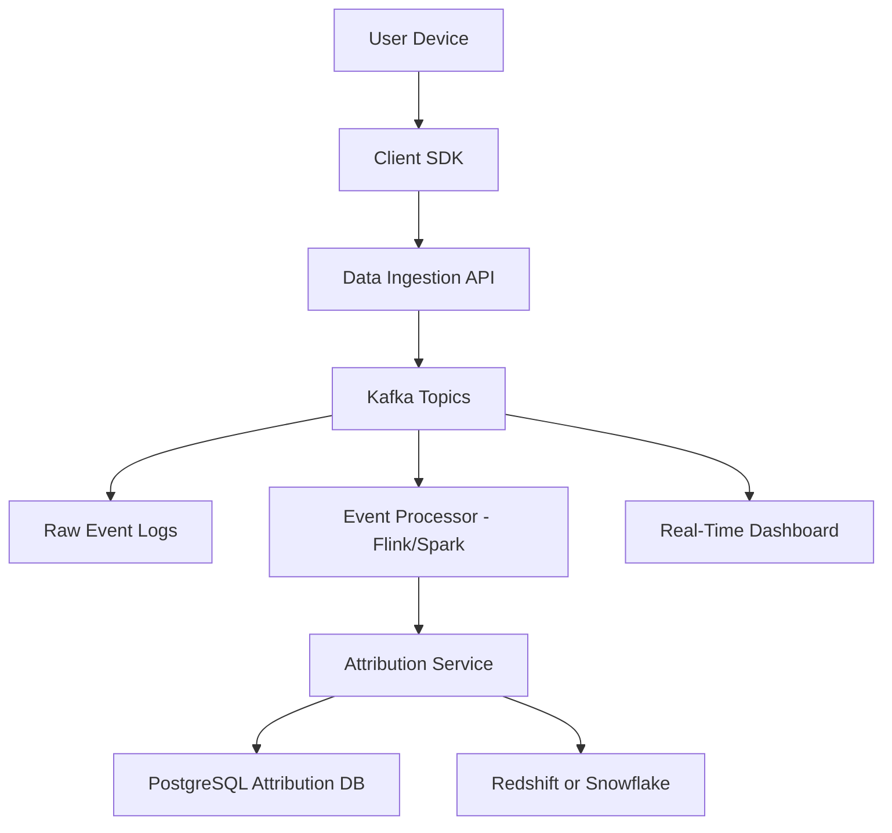
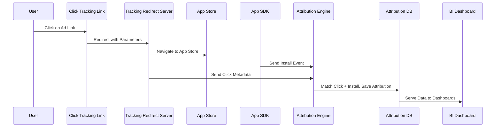

---

## title: report\_a04\_part01\_custom\_tracking

---

## Custom Tracking Service Design

---

### Overview and Objectives

Define the scope, goals, and rationale for building a custom tracking system

---

* **Goal**: Design and implement a custom tracking service for both web and mobile platforms to collect, process, and analyze user behavioral data from app installs to post-install interactions.

  * This system should enable attribution of marketing campaigns, event tracking, and funnel analysis without relying on third-party platforms.
  * The solution must offer real-time capabilities and offline resilience, operating across all major OS and browser environments.

* **Strategic Importance**:

  * Enhance **marketing attribution precision** across all digital campaigns by enabling detailed, verifiable tracking from ad impressions to user actions within the app.
  * Provide **product teams** with granular insights into user interactions, session flows, feature adoption, and error rates to improve UX and retention.
  * Enable **data science teams** to build reliable data models for user segmentation, churn prediction, and customer lifetime value (LTV) estimation.
  * Support **privacy-first strategies** to address evolving regulations and platform restrictions (e.g., iOS ATT, GDPR, CCPA).

* **Key Objectives**:

  * Implement **end-to-end tracking**, including support for click-through, view-through, first-touch, last-touch, and multi-touch attribution.
  * Build a system that supports **real-time data ingestion** with event enrichment pipelines and delayed processing for aggregated analytics.
  * Ensure **cross-platform compatibility**, covering:

    * Native Android/iOS apps
    * React Native and hybrid apps
    * Web applications across modern browsers
  * Design for **security**, including TLS encryption, token-based access, and secure cookie handling.
  * Achieve **privacy compliance** via user consent management, configurable retention policies, and audit logging.

* **Scope of Work**:

  * Implement app install attribution using **deferred deep linking**, **device fingerprinting**, and **click ID resolution**.
  * Enable **event collection** for sessions, conversions, lifecycle events, and custom engagement signals.
  * Include robust **data validation, deduplication, and enrichment** to ensure consistency and accuracy.
  * Build a **dashboard interface** for real-time analytics, campaign performance, and funnel visualization.

* **Audience**:

  * **DevOps and data engineering teams** for infrastructure provisioning, data pipeline reliability, and system scalability.
  * **Backend engineers** for implementing API endpoints, attribution logic, and SDK communications.
  * **Mobile and web developers** responsible for integrating SDKs into the app ecosystem.
  * **Analysts and marketers** who consume the data for decision-making, experimentation, and ROI tracking.
  * **Legal and compliance officers** validating that the system aligns with regulatory requirements for data governance.

---

### Architecture Design

Proposed system architecture and component overview

---

#### Key Components

* **Tracking SDKs**: Language-specific libraries (JavaScript for web, Swift for iOS, Kotlin for Android) that initialize early on app startup to capture contextual data. SDKs should:

  * Handle offline queuing and retry mechanisms
  * Provide interfaces for custom event tracking and user properties
  * Respect platform-specific privacy limitations like iOS App Tracking Transparency (ATT)

* **Tracking Link Generator (Campaign Manager)**:

  * Enables marketers to generate UTM-tagged short links for campaigns
  * Integrates with ad networks for click callbacks
  * Supports deferred deep links for post-install redirection
  * Provides an audit log of all generated links for compliance and debugging

* **Event Collection Layer (REST APIs + CDN endpoint)**:

  * Collects events in a scalable, geo-distributed setup via edge nodes
  * Performs schema validation using Avro/JSON schema
  * Normalizes timestamps, device metadata, and campaign identifiers
  * Buffers traffic during spikes and implements retry/backoff logic

* **Attribution Engine**:

  * Maintains in-memory data store (e.g., Redis or Memcached) for recent click metadata
  * Implements configurable attribution windows (e.g., 7-day click-through, 24-hour view-through)
  * Supports hybrid attribution: first-party deterministic and probabilistic fallback mechanisms
  * Logs attribution decisions for auditability

* **Analytics and Reporting Layer**:

  * Event stream enriched and transformed via Apache Flink/Spark
  * Supports star schema for reporting tables (`fact_events`, `dim_users`, `dim_campaigns`)
  * Enables both scheduled batch reporting and real-time dashboards
  * Provides prebuilt funnel and retention queries via Looker/Superset

* **System Monitoring and Alerting**:

  * Metrics exposed via Prometheus exporters (API throughput, latency, attribution accuracy)
  * Visual dashboards via Grafana
  * Alert policies configured in PagerDuty for 5xx errors, latency spikes, or dropped messages
  * Logging pipeline includes ELK or Loki stack for centralized log aggregation

---

#### Infrastructure Flow Diagram

* Events are tagged with `user_id`, `device_id`, `campaign_id`, and `event_type`
* Attribution events are stored with reference to tracking metadata and computed conversion windows

---

### Technical Implementation Strategy

Development approach and core functionalities

---

#### Tracking Link Mechanics

* **URL Pattern**: `https://track.mycompany.com/redirect?cid=abc123&adgroup=summer_promo`
* **Click Action**: User clicks the tracking link embedded in a campaign:

  * The link redirects through a tracking server that logs metadata (e.g., timestamp, IP address, user-agent, referrer).
  * UTM parameters are parsed and stored in Redis or a short-term persistent store for matching.
  * Device/browser fingerprints are generated and saved (based on OS, browser, screen size, locale, etc.)
  * A redirection follows to either the App Store, Google Play, or fallback landing page.
* **App Open Attribution**:

  * When the app is opened for the first time, the SDK automatically triggers an `install` event.
  * The event includes `device_id`, `bundle_id`, `version`, `locale`, and a possible referral payload.
  * Attribution service attempts to resolve the matching campaign by cross-referencing fingerprints or referral codes stored in Redis within a 24–48 hour attribution window.
  * Attribution decision is logged for future analytics and debugging.

---

#### Event Collection Pipeline

* **Supported Event Types**:

  * Standard: `install`, `session_start`, `page_view`, `add_to_cart`, `purchase`, `logout`, `unsubscribe`
  * Custom: defined by clients via SDK (`track("search", {...})`)
  * Lifecycle: app open/close, screen transitions, backgrounding events

* **Ingestion Endpoints**:

  * `/v1/event`: General-purpose endpoint for all non-install events
  * `/v1/install`: Specifically for install attribution
  * `/v1/click`: Entry point for tracking link clicks and metadata logging
  * Endpoints are secured via HMAC token headers and validated by a gateway before forwarding

* **Internal Processing**:

  * Events are streamed to Kafka and partitioned by event type and `user_id` for parallelism
  * Schemas are validated against Apache Avro schema registry
  * Flink processors:

    * Session assembler (groups events by user + session window)
    * Conversion path extractor (funnel analytics)
    * Anomaly detector (click spam, install bursts)

* **Event Enrichment**:

  * IP enrichment service queries GeoIP to tag location metadata
  * Device type parsing using UA parsers (e.g., uap-core)
  * Clickstream enrichers attach UTM source, campaign, and channel dimensions to events

---

#### Attribution Engine Logic

* **Identifiers Used**:

  * `device_id` (Android ID / IDFV)
  * `cookie_id` (for web sessions)
  * `gaid`, `idfa` (mobile ad identifiers when available)
  * `custom_user_id` (logged-in sessions)

* **Attribution Models**:

  * **Last-touch** (default): credit goes to most recent campaign before conversion
  * **First-touch**: initial touchpoint receives full credit
  * **Multi-touch** (linear or time-decay): partial credit distribution

* **Edge Case Handling**:

  * Organic install fallback (no campaign match)
  * Multiple clicks within attribution window (prioritize by timestamp or channel priority)
  * Re-attribution logic for returning users from retargeting campaigns

* **Storage Architecture**:

  * Metadata stored in normalized relational tables (`users`, `events`, `conversions`, `campaigns`)
  * Redundant writes to OLAP store for reporting (e.g., Snowflake or ClickHouse)
  * Periodic materialized views are refreshed for reporting performance

---

#### Privacy and Security

* **Regulatory Compliance**:

  * GDPR-compliant data processing agreements (DPAs) are assumed with clients
  * CCPA opt-out flag respected across all SDKs and APIs
  * `/v1/user/delete`: hard delete endpoint triggers cascading purges across all downstream stores

* **PII Handling**:

  * Personally identifiable information (e.g., email, phone) is hashed client-side before transmission
  * Encrypted using field-level encryption (AES256) at rest

* **Security Measures**:

  * All traffic enforced over TLS 1.2+
  * Public APIs require API key and optional OAuth2 bearer token
  * Rate limiting and bot mitigation at edge layer (e.g., Cloudflare, AWS WAF)

* **Operational Data Lifecycle**:

  * Retention policies enforce roll-up of old event data (e.g., daily instead of raw)
  * Schedulers clean expired sessions, inactive cookies, and orphaned click records

---

### Challenges and Considerations

Highlight engineering difficulties and system tradeoffs

---

#### Engineering Complexities

* **High-volume traffic**: Event spikes during campaign launches or promotions can overwhelm ingestion layers if not horizontally scalable or backed by sufficient buffer systems (e.g., Kafka).
* **Low-latency attribution**: Matching an install to a click within milliseconds of app open requires optimized in-memory lookups, indexing, and parallel processing pipelines.
* **SDK fragmentation**: Varying support and limitations across Android, iOS, and web (e.g., Safari’s ITP, iOS SKAdNetwork) lead to non-uniform capabilities.
* **Data loss prevention**: Handling user disconnects, offline sessions, or SDK crashes without losing events demands local buffering and sync strategies.
* **Fraud prevention**: Must detect and reject click flooding, fake installs, and emulator traffic without penalizing legitimate edge cases.
* **Cross-device attribution**: Deterministically linking user behavior across mobile, tablet, and web often requires authentication signals or probabilistic fingerprinting.

#### Technical Tradeoffs

* **Flexibility vs Complexity**:

  * Full control over tracking logic allows fine-grained KPIs, business-specific funnel tuning, and experimentation.
  * However, the development cost, infrastructure upkeep, and domain-specific expertise requirements are significant.

* **Accuracy vs Privacy**:

  * Device fingerprinting enhances match rates in anonymous contexts but conflicts with privacy-first design principles and can breach jurisdictional laws if not transparently disclosed.
  * Opting for deterministic-only attribution reduces tracking coverage but aligns better with evolving compliance requirements.

* **Reliability vs Cost**:

  * Ensuring high durability via replication across zones, message retries, and warm standby clusters adds significant storage and compute costs.
  * Duplicate detection via idempotency keys and consistent hashing prevents data inflation but introduces latency and computational overhead.

* **Real-time insights vs batch efficiency**:

  * Real-time dashboards require streaming transformations and low-latency processing, whereas batch mode (daily/hourly aggregation) is more cost-efficient and easier to maintain.

* **Customizability vs Vendor Support**:

  * A self-hosted pipeline enables internal analytics innovation but lacks the turnkey integrations and SLA-backed reliability of commercial attribution services.

---

### Event Flow and Attribution Diagram

Visualize end-to-end event and attribution flow

---

---

### Implementation Timeline and Milestones

Chronological roadmap for system development and deployment

---

#### Sprint 1: Foundations

* Define data models: `event`, `campaign`, `user_id_map`, `attribution`
* Choose tech stack: GoLang for backend APIs, Kafka for event streaming, PostgreSQL for metadata storage
* Conduct technical feasibility analysis for cross-platform SDK development
* Build mock API endpoints and test data payload contracts
* Prototype campaign link generator UI and basic redirect handler with logging

#### Sprint 2: Core System Implementation

* Build ingestion APIs with input validation and idempotency support
* Implement Redis caching layer for temporary storage of click metadata
* Deploy Kafka and Flink cluster with stream partitioning strategy
* Create scalable event ingestion service with rate limiting and observability hooks
* Set up secure CI/CD pipeline for automated testing and integration

#### Sprint 3: Attribution Layer

* Implement matching logic between clicks and installs using sliding time windows
* Configure attribution rules engine to support first-touch, last-touch, and custom models
* Write comprehensive unit and integration tests for fraud patterns and edge cases
* Build analytics tables and materialized views for quick query performance
* Integrate fallback matching (probabilistic model) for privacy-restricted environments

#### Sprint 4: SDK Integration and QA

* Embed SDKs into demo applications (Android/iOS/web) with debug mode support
* Simulate user journeys including click → install → post-install events
* Generate synthetic campaigns to validate attribution accuracy and reporting completeness
* Instrument SDKs and APIs with OpenTelemetry for distributed tracing
* Begin early-stage QA: UI regressions, event delivery reliability, consent management flows

#### Sprint 5: Staging to Production

* Finalize Terraform IaC scripts and Ansible playbooks for cloud infrastructure deployment
* Enforce HTTPS, CORS policies, API authentication/authorization, and rate limiting controls
* Run load tests and failover simulations to evaluate system resilience under pressure
* Deploy real-time dashboard and business-facing analytics reports
* Launch limited beta campaign with internal or pilot user base
* Monitor metrics (event volume, attribution match rate, latency) and iterate before full rollout

---

### Stakeholder Considerations

Communicate business value and implications to non-engineering stakeholders

---

* **Marketing ROI Measurement**:

  * Clear visibility into which campaigns generate meaningful installs
  * Cost-per-install (CPI) and cost-per-action (CPA) tracking

* **User Behavior Insight**:

  * Visualize customer journey across app lifecycle
  * Identify friction points (drop-offs, uninstall triggers)

* **Compliance and Control**:

  * First-party solution ensures auditability and avoids 3rd-party lock-in
  * Full ownership of event data enables tailored analytics without black-box attribution

* **Future-Readiness**:

  * Platform can evolve with shifting ad tech regulations
  * Modular components enable downstream ML integration for LTV prediction

---

