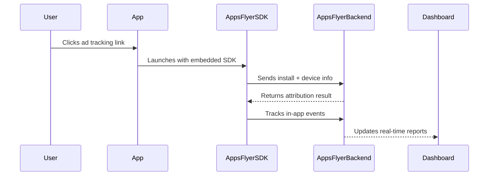
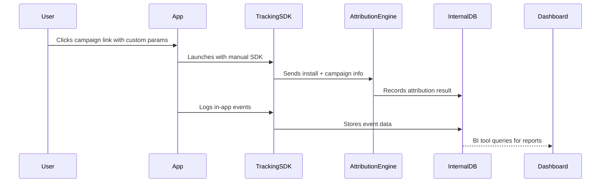

---

## title: report\_a04b

---

## AppsFlyer Integration Assessment

---

### Overview of Commercial Tracking Platforms

Understand the role of commercial tools in solving attribution challenges

---

* **AppsFlyer** is a leading mobile attribution and marketing analytics platform.
* It offers a comprehensive SDK that enables user behavior tracking, attribution modeling, and marketing performance analysis.
* Commercial solutions like AppsFlyer are designed to handle tracking complexity across platforms (iOS, Android, Web).
* Built-in compliance with privacy regulations (GDPR, CCPA) simplifies global deployment.

#### Key Use Cases for Commercial Tracking

* **App Install Attribution**

  * Tracks installs across paid and organic channels.
  * Attributes installs to the right campaign source using fingerprinting, ID matching, and deep links.

* **Event Tracking**

  * Records post-install in-app actions like purchases, sign-ups, and feature usage.

* **Campaign Performance Measurement**

  * Offers dashboards and cohort analysis to compare marketing channels.

* **Audience Segmentation and Retargeting**

  * Enables dynamic audience creation based on user behavior for remarketing.

---

#### Why Businesses Use Commercial Solutions

* **Faster Deployment**

  * Plug-and-play SDK with minimal engineering effort.

* **Cross-Platform Support**

  * Unified view of iOS, Android, and web app behavior.

* **Integrated Ecosystem**

  * Native integrations with ad networks, analytics tools, and MMP partners.

* **Data Integrity and Fraud Protection**

  * Built-in validation mechanisms for install and event fraud detection.

---

### Comparison: Custom Tracking System vs. AppsFlyer

Detailed technical and strategic comparison

---

| **Aspect**              | **Custom Tracking System**                            | **AppsFlyer**                                              |
| ----------------------- | ----------------------------------------------------- | ---------------------------------------------------------- |
| **Setup Time**          | Weeks to months                                       | Few hours                                                  |
| **Attribution Logic**   | Must be designed manually                             | Pre-built with configurable rules                          |
| **Device Matching**     | Requires development of fingerprinting & deep linking | Built-in advanced device ID and probabilistic matching     |
| **Cross-Platform Sync** | Manual sync between mobile/web tracking layers        | Unified SDK and reporting stack                            |
| **Fraud Detection**     | Needs custom heuristics                               | Built-in fraud protection and real-time blocking           |
| **Analytics Dashboard** | Custom BI implementation required                     | Real-time dashboard with cohort analysis                   |
| **Raw Data Exports**    | Must build API or database extraction manually        | Provides Data Locker (S3) and Pull API with schema support |
| **API Access**          | Requires full backend dev for ingestion & reporting   | RESTful API access for pull reports, events, and cost data |
| **Cost**                | High initial engineering cost, low marginal cost      | Subscription-based with varying tiers                      |
| **Compliance**          | Must implement data protection and consent tracking   | Built-in compliance framework with regional controls       |

---

### Event Flow: AppsFlyer Tracking Lifecycle

How user behavior and attribution data move through AppsFlyer

---

---

#### Raw Data Export Options

* **Pull API**: RESTful API to retrieve aggregated data (attribution, performance, event stats).
* **Data Locker**: Continuous raw data export to AWS S3 (supports event-level granularity).
* **Cloud Integrations**: Direct export connectors for BigQuery, Snowflake, Redshift.

#### API Integration Use Cases

* **Sync with Internal BI Tools**

  * Schedule API calls to fetch daily event summaries.

* **Campaign Reporting**

  * Combine AppsFlyer data with CRM or ad-spend reports for ROI calculations.

* **User Journey Analysis**

  * Map custom funnels using exported in-app events and attribution metadata.

---

### Event Flow: Custom Tracking System

How a self-built tracking system processes events and attribution

---

---

#### Engineering Requirements

* **Tracking SDK**

  * Must create platform-specific SDKs (Android/iOS/Web) to collect and send data.

* **Attribution Engine**

  * Match install links to stored campaign clicks using device fingerprints or cookies.

* **Database Schema**

  * Design scalable storage models for user-level event history and attribution chains.

* **API Layer**

  * Build endpoints to expose events and attribution data for analytics.

* **ETL Pipelines**

  * Transfer data to BI tools or dashboards (e.g., Airflow + Redshift).

---

### Problems Solved by AppsFlyer

Challenges of custom tracking and how AppsFlyer solves them

---

#### Attribution Complexity

* **Custom System**: Requires full implementation of fingerprinting, deep linking, and campaign tracking logic.
* **AppsFlyer**: Handles attribution via deterministic and probabilistic methods automatically.

---

#### Data Reliability & Accuracy

* **Custom System**: Attribution often breaks due to iOS/Android changes, cookie loss, or anti-tracking policies.
* **AppsFlyer**: Regular updates and platform support for latest privacy standards.

---

#### Cross-Device Tracking

* **Custom System**: Hard to unify user behavior across web and app.
* **AppsFlyer**: Built-in support for unified user identity with deep linking and People-Based Attribution.

---

#### Fraud Prevention

* **Custom System**: Difficult to detect bot installs or click spamming.
* **AppsFlyer**: Includes Protect360 with anomaly detection, real-time blocking, and network scoring.

---

#### Engineering Overhead

* **Custom System**: Ongoing effort needed for maintenance and SDK updates.
* **AppsFlyer**: Minimal maintenance; handles updates and SDK compatibility.

---

### Implementation Considerations

Strategic factors in choosing AppsFlyer over custom tracking

---

* **Team Size and Capacity**

  * Small teams benefit from offloading tracking logic to AppsFlyer.

* **Speed to Market**

  * Marketing teams can test campaigns faster without waiting for backend engineering cycles.

* **Need for Ad Network Integration**

  * AppsFlyer integrates with 100+ networks (Google Ads, Meta, TikTok) by default.

* **Security and Compliance Needs**

  * AppsFlyer supports consent mode, GDPR/CCPA tagging, and regional data hosting.

* **Analytics Requirements**

  * If in-house BI tools exist, raw data exports (Pull API, Data Locker) can be used.

* **Cost Justification**

  * Early-stage startups might prefer custom solutions; mid-to-large orgs save more with managed service.

---

